# PhotoRename AI App - User Stories Flow Diagram

```mermaid
graph TD
    A[Index - Landing Page] --> B[Login/Signup]
    
    B --> C[Dashboard]
    
    %% User Story 1: Upload and Rename Photos
    C --> D[Upload Photos]
    D --> E[AI Processing]
    E --> F[Review Results]
    F --> G[Download Renamed Photos]
    
    %% User Story 2: Search and Find Photos
    C --> H[Photo Library/Search]
    H --> I[Search Results]
    I --> J[Photo Details/Preview]
    
    %% User Story 3: Organize Photo Library
    C --> K[Auto Organization]
    K --> L[Folder Structure Preview]
    L --> M[Export Organized Library]
    
    %% User Story 4: Account Preferences
    C --> N[Account Settings]
    N --> O[Profile Settings]
    N --> P[Processing Preferences]
    N --> Q[Privacy & Data Settings]
    N --> R[Notification Settings]
    
    %% User Story 5: Usage Monitoring & Plans
    C --> S[Billing & Plans]
    S --> T[Usage Dashboard]
    S --> U[Plan Comparison]
    S --> V[Upgrade/Downgrade]
    
    %% User Story 6: Subscription Management
    S --> W[Payment Methods]
    S --> X[Billing History]
    S --> Y[Subscription Controls]
    Y --> Z[Pause/Cancel Options]
    
    %% Supporting Pages
    A --> AA[Pricing]
    A --> BB[Help & Docs]
    
    %% User Story Labels
    D -.-> US1["`**User Story 1**
    Upload & Rename Photos
    'I want descriptive filenames'`"]
    
    H -.-> US2["`**User Story 2**
    Search & Find Photos
    'I want to search naturally'`"]
    
    K -.-> US3["`**User Story 3**
    Auto Organization
    'I want logical folders'`"]
    
    N -.-> US4["`**User Story 4**
    Account Preferences
    'I want custom settings'`"]
    
    T -.-> US5["`**User Story 5**
    Usage & Plan Monitoring
    'I want to track my limits'`"]
    
    Y -.-> US6["`**User Story 6**
    Subscription Management
    'I want billing control'`"]
    
    %% Styling
    style US1 fill:#22c55e,stroke:#16a34a,color:#fff
    style US2 fill:#3b82f6,stroke:#2563eb,color:#fff
    style US3 fill:#f59e0b,stroke:#d97706,color:#fff
    style US4 fill:#8b5cf6,stroke:#7c3aed,color:#fff
    style US5 fill:#ef4444,stroke:#dc2626,color:#fff
    style US6 fill:#ec4899,stroke:#db2777,color:#fff
    style C fill:#374151,stroke:#1f2937,color:#fff
    style A fill:#059669,stroke:#047857,color:#fff
```

## User Stories Summary

1. **Upload & Rename Photos** - Core photo processing functionality
2. **Search & Find Photos** - Natural language photo search
3. **Auto Organization** - Intelligent folder structuring
4. **Account Preferences** - Customizable settings and privacy
5. **Usage & Plan Monitoring** - Track limits and upgrade options
6. **Subscription Management** - Full billing and subscription control