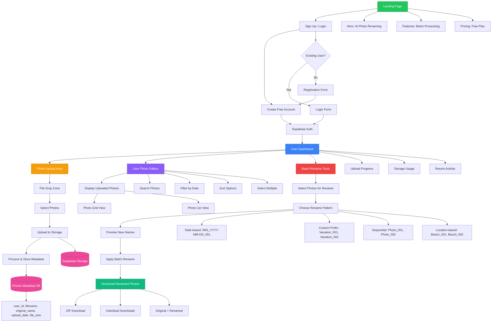

# PhotoRename AI App - Structure & User Flow

## Core User Journey

1. **Landing** - Users visit the landing page showcasing AI photo renaming
2. **Authentication** - Free account creation with Supabase auth
3. **Dashboard** - Central hub with upload, gallery, and rename tools
4. **Upload** - Drag & drop photo upload with progress tracking
5. **Gallery** - View, search, and manage uploaded photos
6. **Batch Rename** - Select photos, choose patterns, preview, and apply
7. **Download** - Get renamed photos as ZIP or individual files

## Key Features

- **Free Account Creation** - No barriers to entry
- **Photo Upload & Storage** - Secure cloud storage via Supabase
- **Smart Gallery** - Grid/list views with search and filters
- **Batch Renaming** - Multiple naming patterns and preview
- **Download Options** - Flexible download formats

## Database Schema

- **Photos Metadata**: user_id, filename, original_name, upload_date, file_size
- **Supabase Storage**: Secure file storage with user-based access
- **Authentication**: Built-in user management and session handling